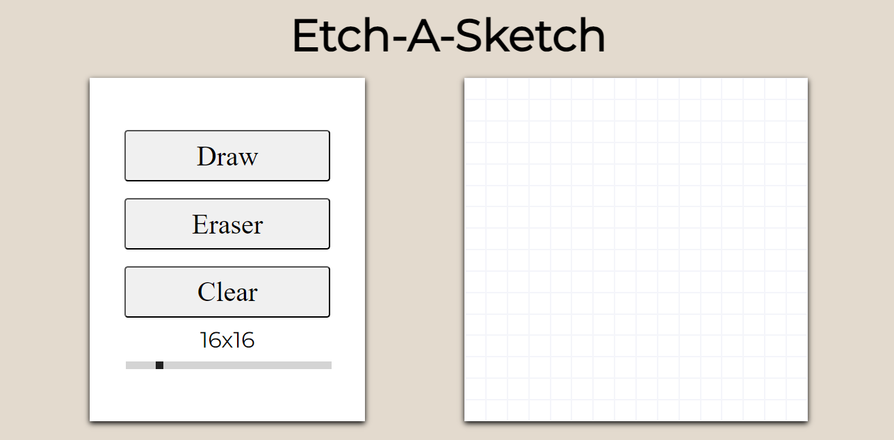

# Etch-A-Sketch
A recreation of a Etch-A-Sketch on a web page able to change size of grid, draw, erase, and clear the grid

## Access
Accessible from https://ama4538.github.io/Etch-A-Sketch/

## Installation
1. Clone the repository: git clone https://github.com/Ama4538/Etch-A-Sketch.git
2. install dependencies: npm install
3. Run built in script: npm run start

### Tech Stack
- HTML
- CSS
- JavaScript

### Tools
- Webpack
